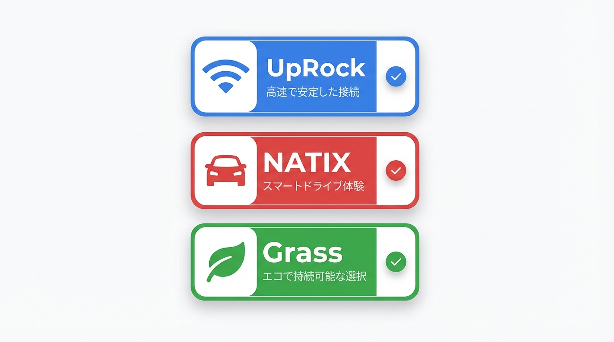
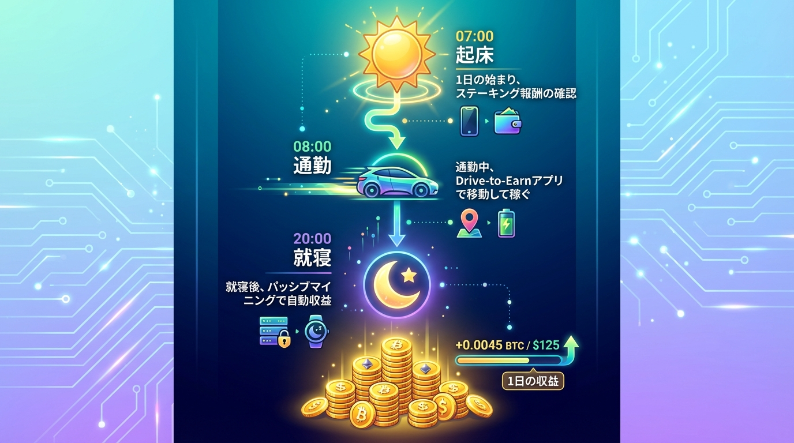

「ポイ活で動画広告を何十回も見るのに疲れていませんか？」

正直、僕もそうでした。1再生0.1円の世界で消耗するのは、もう時代遅れかもしれません。
2026年現在、ポイ活のトレンドは大きく変わっています。キーワードは**「労働」から「提供」へ**。

あなたが寝ている間や、車を運転している間に、スマホが勝手に稼いでくれる。そんなSFのような話が、**「DePIN（ディーピン）」**という技術で現実になっています。
かつての「Honeygain」のような帯域幅シェアだけでなく、今は**AI（人工知能）の学習データ提供**が主流になり、単価も上昇傾向にあります。

この記事では、怪しいと思われがちな「DePIN」の仕組みをクリアにし、**スマホ1台で月5,000円を目指すための最新アプリ3選**と、具体的な攻略ロードマップを解説します。

先行者利益がまだ残っている今が、参入のラストチャンスかもしれません。

## そもそも「DePIN（ディーピン）」って何？怪しくないの？

聞き慣れない単語ですが、仕組みはシンプルです。
**DePIN（Decentralized Physical Infrastructure Networks）**とは、直訳すると「分散型物理インフラネットワーク」。

簡単に言うと、**「AmazonやGoogleが独占していたインフラを、みんなのスマホやPCでちょっとずつ分担しよう」**というプロジェクトです。

### なぜ「放置」で稼げるのか？
企業（特にAI開発企業）は、AIを賢くするために「リアルタイムのWebデータ」や「道路の画像データ」を喉から手が出るほど欲しがっています。
しかし、自社で世界中のデータを集めるのはコストがかかりすぎます。

そこで、あなたのスマホの出番です。
* **あなた**: 使っていない通信帯域や、カメラの映像データを提供する。
* **企業**: その対価として、仮想通貨（トークン）を支払う。

これがDePINの稼げる仕組みです。「怪しいお金」ではなく、**「データ提供の正当な対価」**を受け取っているだけなのです。
2026年は特に、AIバブルの影響でこの「データ需要」が爆発しており、以前よりも稼ぎやすくなっています。

---

## スマホに入れて放置！おすすめDePINアプリ3選【2026最新】

PC必須のプロジェクトが多い中、今回は**「スマホ（特にiPhone/Android）だけで完結する」**ものに厳選しました。
すべて初期費用は0円です。

### 1. UpRock (アップロック)
**【完全放置型】Honeygainの上位互換**

「Honeygain」を知っている人なら話は早いです。あれの進化版です。
UpRockは、スマホの余っている帯域幅を使って、AIのためのデータ収集（スクレイピング）を手助けします。

* **メリット**: アプリを入れて「Mining（マイニング）」ボタンを押すだけ。あとはバックグラウンドで動く。
* **収益性**: 2026年現在、AI需要の高まりでトークン単価が安定。
* **注意点**: バッテリー消費は少なめですが、Wi-Fi環境推奨です。

### 2. NATIX Drive& (ナティックス)
**【移動・ドライブ型】運転が「お金」に変わる**

これは「放置」というより「ついで」稼ぎです。
車を運転する際、スマホをドラレコのようにダッシュボードに設置し、カメラで道路状況をスキャンします。
このデータが地図情報の更新や自動運転AIの学習に使われます。

* **メリット**: 運転距離が長い人（通勤・配送業）は最強に稼げる。
* **2026年の進化**: 単なるマッピングだけでなく、AIモデル（World Foundation Models）へのデータ提供としての価値が高まっています。
* **注意点**: カメラを使うのでバッテリー消費が激しいです。充電ケーブル必須。

### 3. Grass (グラス)
**【高単価型】Web拡張機能の王者**

本来はPC（Chrome拡張機能）で最強のプロジェクトですが、スマホでも「Mises Browser」などの拡張機能が使えるブラウザアプリを経由することで参加可能です。
Webの公開データをAI向けに整理する役割を担います。

* **メリット**: DePIN界隈で最も勢いがあり、トークンの流動性（換金のしやすさ）が高い。
* **攻略法**: PCを持っているならPCで。スマホならWi-Fi接続時のみ稼働させるのが吉。

---

## 月5,000円を目指す「組み合わせ」ロードマップ

正直、どれか1つだけでは月数百円〜1,000円程度で終わることもあります。
DePINポイ活の極意は**「併用」**です。

僕が実践している、スマホのスペックを無駄にしない「最強ルーティン」を紹介します。

### 平日の稼働スケジュール

1.  **7:00 起床・朝の準備**
    * 自宅Wi-Fiで **UpRock** と **Grass** をオン（スマホ放置）。
    * 朝食中に勝手にチャリンチャリン。

2.  **8:00 通勤（車の場合）**
    * **NATIX** を起動し、ダッシュボードにセット。
    * 通勤の30分〜1時間がそのまま収益化。
    * （電車通勤の場合は、移動でポイントが貯まる「トリマ」なども併用推奨）

3.  **9:00〜18:00 仕事中**
    * 会社のWi-Fi（許可されている場合）や、自宅に置いたサブ端末で **UpRock** を稼働継続。
    * メイン端末はバッテリー節約のため一時オフでもOK。

4.  **20:00 帰宅後**
    * 再びWi-Fi環境で全アプリフル稼働。
    * 寝ている間も充電器に繋いで放置。

### 換金ルートの正解（2026年版）
稼いだトークンを日本円にするには、以下のルートが鉄板です。手数料で損しないようにしましょう。

1.  各アプリから **Solanaチェーン対応ウォレット（Phantomなど）** へ出金。
2.  DEX（分散型取引所）または海外取引所で **USDC** や **SOL** に交換。
3.  日本の取引所（コインチェックやGMOコインなど）へ送金し、日本円へ。

※2026年はSolanaチェーンの手数料（ガス代）が依然として安いため、こまめな出金も可能です。

---

## デメリットと危険性も正直に話します

「うまい話」には必ず裏があります。リスクを理解してから始めましょう。

### 1. バッテリー寿命への影響
特にNATIXのようなカメラ・GPS常時使用アプリは、バッテリーを劣化させる可能性があります。
**対策**: メインのiPhone 16などではなく、機種変更で余った「サブ機」や「中古のAndroid」を使うのが賢いやり方です。

### 2. 通信制限（ギガ死）
モバイルデータ通信で常時接続すると、あっという間にギガが減ります。
**対策**: 設定で「Wi-Fiのみで稼働」にするのが必須です。UpRockなどは設定で切り替え可能です。

### 3. プライバシーの懸念
「カメラや位置情報を送って大丈夫？」と不安になりますよね。
基本的にDePINプロジェクトは、データ送信時に**「個人を特定できる情報（顔やナンバープレート）」をAIで自動的にモザイク処理/匿名化**しています。
しかし、念のため自宅周辺ではNATIXをオフにするなど、自衛はしておきましょう。

---

## まとめ：先行者利益は「今」しかない

DePINプロジェクトには**「半減期」**のような概念があり、参加者が増えれば増えるほど、1人あたりの報酬は減っていきます。
Honeygainがそうだったように、知名度が上がってからでは「お小遣い程度」しか稼げません。

* **UpRock** でベースを稼ぐ
* **NATIX** で移動時間をハックする
* **Grass** で高単価を狙う

この3本柱なら、2026年の今、スマホ1台で月5,000円（年間6万円！）は十分に射程圏内です。
6万円あれば、新しいガジェットやゲームが買えますよね。

まずはアプリをダウンロードして、アカウントを作ることから始めてみてください。
「寝て起きたらお金が増えている」感覚を、ぜひ味わってほしいです。
