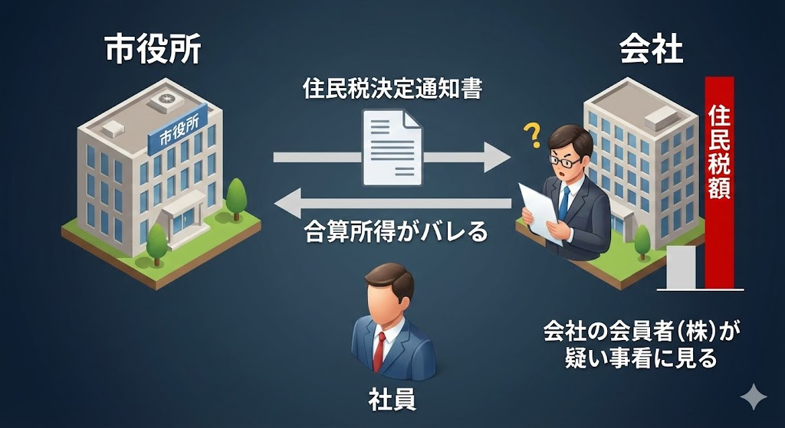
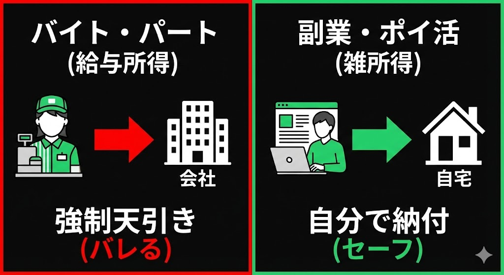

2月16日。今年もまた、国民の義務であり、副業民にとっては「審判の日」である確定申告の受付が始まります。

「俺は副業の利益が15万円くらいだから、申告しなくていいんでしょ？」
「メルカリの売上はバレないよね？」

もしあなたが今、スマホを見ながらそう思っているなら、**あなたは既に「脱税予備軍」であり、会社にバレる寸前かもしれません。**

ネット上には「20万円以下は申告不要」という言葉が独り歩きしていますが、これは**「所得税（国税）」だけの話**。
あなたの住む街の**「住民税（地方税）」には、20万円ルールなんて存在しません。**

今回は、2026年（令和7年分）の申告シーズンに向け、絶対に知っておくべき「バレないための境界線」と、近年厳格化された「バイト副業の強制徴収リスク」について解説します。

---

## 誤解だらけの「20万円ルール」：住民税は1円から！

まず、このチャートを見て、自分がどこに当てはまるか確認してください。
これが全ての基本です。

### 1. 所得税（税務署）：20万円の壁がある
国（税務署）に納める「所得税」に関しては、本業の給与所得がある会社員の場合、**副業の「所得（収入ー経費）」が年間20万円以下なら、確定申告は不要**です。
これは間違いありません。

### 2. 住民税（市役所）：免除なし
しかし、**住民税には「20万円の免除ルール」はありません。**
たとえ副業の利益が「1万円」や「1,000円」であっても、自治体への申告義務があります。

もしあなたが「20万円以下だから確定申告しなくていいや（＝何もしない）」を選択した場合、**住民税の「無申告」状態**になります。
これが後々、延滞金を含めた追徴課税や、会社への通知に繋がるのです。

---

## なぜ会社にバレるのか？「住民税決定通知書」の恐怖

会社員が副業バレする最大の要因は、SNSへの書き込みでも同僚のチクリでもありません。
**毎年5月〜6月に会社に届く「住民税決定通知書」**です。

### バレるメカニズム
日本の会社員は、原則として住民税を給料から天引き（特別徴収）されています。
自治体は、あなたの「本業の給料」と「副業の利益」を合算して住民税を計算し、その総額を会社に通知します。

経理担当者はこう思います。
**「あれ？ A君とB君は同じ給料なのに、A君だけ住民税が異常に高いぞ？」**

これで一発アウトです。

### これまでの回避策：「普通徴収」
これを防ぐ唯一の方法が、確定申告書の「住民税・事業税に関する事項」の欄で、**「自分で納付（普通徴収）」にチェックを入れる**ことでした。
こうすれば、副業分の住民税通知は自宅に届き、会社には本業分しか通知されません。

しかし、**2026年現在、この技が通用しないケース**が増えています。

---

## 【警告】「バイト副業」は隠せない時代へ

ここが今回の記事で最も伝えたい、2026年の残酷な現実です。
副業の種類によって、「普通徴収（自分で納付）」が選べるかどうかが決まります。

### 危険度MAX：パート・アルバイト（給与所得）
もしあなたが、仕事終わりにコンビニや居酒屋でバイトをしている場合、その収入は**「給与所得」**になります。

多くの自治体（東京都など）では現在、**「給与所得はすべて合算して、本業の会社から特別徴収（天引き）する」という運用を徹底**しています。
つまり、確定申告でいくら「自分で納付」にチェックを入れても、**自治体側で無視され、強制的に本業の会社に通知が送られる**ケースが激増しています。

「バイト副業は100%バレる」と思っておいた方が安全です。

### 比較的安全：Uber Eats・ブログ・動画編集（雑所得・事業所得）
一方で、雇用契約を結ばない個人事業主としての収入（雑所得・事業所得）であれば、まだ「普通徴収」を選択できる自治体がほとんどです。
会社にバレたくないなら、**「給与」をもらうバイトではなく、「報酬」をもらうビジネス**を選ぶのが鉄則です。

---

## メルカリ・ポイ活民の境界線

「じゃあ、メルカリやポイ活はどうなの？」という疑問にお答えします。

### 1. メルカリ・ヤフオク（不用品処分）
* **原則：非課税（申告不要）**
* 着なくなった服、読まなくなった本、使わなくなったゲーム機など、「生活用動産」を売った利益は税金がかかりません。30万円以上の貴金属や美術品を除く。

### 2. メルカリ（転売・ハンドメイド）
* **原則：雑所得（課税対象）**
* 利益を得るために仕入れた商品を売ったり、自作のアクセサリーを継続的に販売している場合は「営利目的」とみなされ、申告が必要です。

### 3. ポイ活（ポイントサイト）
* **原則：雑所得（一時所得の場合も）**
* ポイントサイトで稼いだり、アフィリエイトで得たポイントは、**「現金やギフト券、他社ポイントに交換した時点」**で所得（収入）になります。
* 保有しているだけなら課税されません。

---

## 結論：20万円以下でも「住民税の申告」に行こう

「確定申告は面倒だけど、会社にバレたくない」
「副業利益は10万円くらいだ」

そんなあなたがやるべきことは一つです。
**お住まいの市役所（区役所）に行き、「住民税の申告」を行うこと。**

これなら税務署の確定申告（所得税）は不要なまま、住民税だけを正しく納めることができます。
そして申告書の納付方法欄で、必ず**「普通徴収（自分で納付）」**を選んでください（※雑所得の場合）。

### 2026年の最終防衛ライン
1.  **バイト副業（給与）はやめる**: バレるリスクが高すぎる。
2.  **20万円以下でも住民税申告**: 無申告加算税のリスクを回避。
3.  **雑所得で稼ぐ**: 「自分で納付」が選べるポイ活や個人請負にシフトする。

税金は「知らなかった」では済まされません。
たった数千円の住民税をケチったせいで、本業の信用を失うことのないよう、正しい手続きで春を迎えましょう。

※本記事は一般的な税制の解説です。個別のケースについては、必ず税理士または最寄りの税務署・自治体窓口にご相談ください。

---