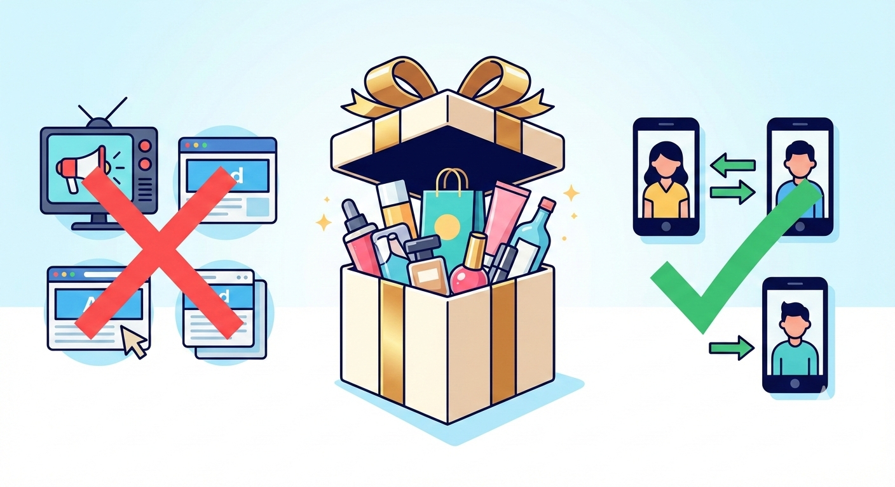
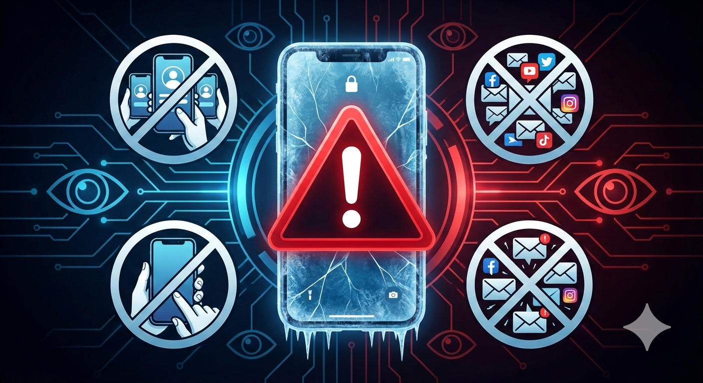

「SHEINのリンクを踏むだけで10点無料になるって本当？」
「SNSでよく見るけど、詐欺じゃないの？怪しい…」

SNSを見ていると、毎日のように流れてくるSHEINの「無料ギフト」や「10点無料」の招待リンク。実際にタダでもらえるならやりたいけれど、個人情報の流出やアカウント停止（垢BAN）が怖くて手が出せないという方も多いのではないでしょうか。

結論から言うと、**2026年現在もSHEINの「10点無料（タダポチ）」は本当に可能**です。

ただし、2025年後半からの越境ECに対する国際的な規制強化（デミニミスルールの見直しなど）に伴い、SHEIN側の「招待判定システム」は劇的に厳しくなっています。昔のように「自分でサブ端末を使ってクリア」といった適当なやり方では、即座に弾かれるだけでなくアカウント自体が凍結されるリスクがあります。

本記事では、2026年最新のSHEIN無料ギフトのカラクリと、絶対にやってはいけないNG行動、そして**安全にタダポチを成功させるための具体的な裏ワザ**を徹底解説します。

---

## 2026年最新版！SHEIN「10点無料」の仕組みとカラクリ

まずは、なぜSHEINが「商品を10点も無料で配るのか」というカラクリを理解しておきましょう。ここを理解していないと、途中で挫折しやすくなります。

### 無料で配ってもSHEINが儲かる理由
SHEINが展開している「マジックドロー」や「無料ギフト」といったミニゲームは、既存ユーザーに「新規ユーザーを連れてこさせる」ための強力なマーケティング施策です。

2025年にジェトロ（日本貿易振興機構）が発表した「世界貿易投資報告」などでも言及されているように、米国を中心とした少額免税措置の厳格化により、越境ECプラットフォームは単なる「ばらまき」から「確実な新規顧客の獲得」へと戦略をシフトしました。

つまり、テレビCMやWeb広告に莫大な費用をかける代わりに、**「確実に新しいお客さんを連れてきてくれた既存ユーザーへ、広告費の代わりに自社商品をプレゼントする」**という仕組みなのです。だからこそ、本当に無料でもらうことができます。

### 成功条件は「新規ユーザーの招待」が絶対条件
ゲームを開始すると、画面上では「あと0.1円でクリア！」のように表示され、簡単に達成できそうな錯覚に陥ります。しかし、既存ユーザー同士でのリンク踏み合い（相互タップ）だけでは、ゲージは小数点以下の極小単位でしか進みません。

2026年現在の仕様では、**「アプリを一度もインストールしたことのない新規ユーザー」を最低でも1〜2人は招待しないと、10点無料の達成はほぼ不可能**に設定されています。

「どうせ無理だろうな…」と諦める前に、まずはゲーム自体をスタートさせて、自分が欲しい商品をリストアップしてみましょう。下記の最新の招待リンクから始めると、ゲームを有利に進められるボーナス状態からスタートできます。

👉 **[【2026年最新】SHEINの10点無料ゲームを有利に始める（公式リンク）](https://onelink.shein.com/30/5hlvxn8go22j?shc=2_ltgqcoP63Bg&channel=copyInviteLink)**

---

## 絶対にやってはいけない！垢BANになる3つのNG行動

「どうしても無料で欲しい！」という焦りから、ルール違反を犯してしまう人が後を絶ちません。2026年のAI判定システムは非常に優秀で、不正は一瞬で検知されます。以下の3つは絶対にやめましょう。

### 1. 複数アカウント（捨て垢）での自作自演
最も多い失敗パターンです。自分のスマホやタブレットで、別のメールアドレスを使って新しくアカウントを作り、自分の招待リンクを踏む行為です。
SHEINは端末のIPアドレス、デバイスID、Cookieなどを厳密に監視しています。同一端末や同一Wi-Fi環境からの連続した新規登録は「不正な自作自演」とみなされ、即座に無効化されるだけでなく、メインアカウントが凍結される（垢BAN）可能性が非常に高いです。

### 2. X（旧Twitter）での無差別なスパム連投
「リンク踏んでください！お返しします！」というポストを、無関係なハッシュタグをつけて大量に連投する行為です。
現在、Xのアルゴリズムはこのようなスパム行為を厳しく制限しています。アカウントのシャドウバン（他の人から投稿が見えなくなるペナルティ）を受けるだけでなく、第三者から悪意のあるフィッシングサイトのリンクを「お返し」として送りつけられる詐欺被害に遭うリスクもあります。

### 3. フリマアプリ等での「招待枠の売買」
メルカリなどで「SHEINの新規招待枠を300円で売ります」といった取引が見受けられますが、これはプラットフォームの規約違反に該当します。購入したとしても、相手が本当に新規ユーザーである保証はなく、最悪の場合は双方のアカウントがペナルティを受けます。

---

## 2026年流！タダポチを安全に成功させる3つの裏ワザ

では、どうすれば垢BANのリスクをゼロにして、安全に10点無料を達成できるのでしょうか？僕が実際に検証して効果が高かった「2026年版の攻略ルート」を3つ紹介します。

### 裏ワザ1：家族や親しい友人の「スマホを直接借りる」
最も確実で安全な方法は、まだSHEINを使ったことがない家族（親や兄弟）や、リアルな友人に直接お願いすることです。
LINEでリンクを送るだけでなく、「一緒に選んであげるから、1着プレゼントするよ！」と提案するのがコツです。相手のスマホでアプリをダウンロードし、自分の招待リンク経由で登録を完了させます。Wi-Fiは切り、各自のモバイル通信（4G/5G）で行うと同一IP弾きを確実に回避できます。

### 裏ワザ2：クローズドな「相互協力コミュニティ」を活用する
不特定多数が見るSNSでの連投はNGですが、DiscordやLINEのオープンチャットに存在する「SHEIN招待専用の鍵付きコミュニティ」は現在でも有効に機能しています。
ルールがしっかり管理されているグループであれば、「既存ユーザー同士の相互タップ枠」を無駄なく消化し合い、ゲージをギリギリまで進めることができます。

### 裏ワザ3：イベント期間の「難易度緩和タイミング」を狙う
SHEINは定期的にルールの緩和（キャンペーン）を行います。特に月末や、大型セールの直前（ブラックフライデーやサイバーマンデーなど）は、「既存ユーザーのタップだけでもゲージが進みやすくなる」ボーナスタイムが発生することがあります。
このタイミングを逃さないためにも、まずは自分のアカウントでゲームを有効化し、いつでも招待できる状態を作っておくことが重要です。

今すぐ以下のリンクからゲームをスタートさせて、ボーナスタイムに備えておきましょう！

👉 **[【期間限定ボーナスあり】SHEINの無料ギフトに今すぐ挑戦する](https://onelink.shein.com/30/5hlvxn8go22j?shc=2_ltgqcoP63Bg&channel=copyInviteLink)**

---

## 読者の疑問・よくある質問（Q&A）

ここでは、ブログ読者からよく寄せられる「SHEINの無料ギフトに関する疑問」にお答えします。

**Q. 本当に完全無料ですか？送料や後から請求がきたりしませんか？**
A. はい、完全に無料です。条件を達成すると、選んだ10点の商品が「0円」で決済され、送料もかかりません。後からクレジットカードに請求が来ることも一切ありませんので安心してください。

**Q. 制限時間はありますか？**
A. あります。ゲーム開始から「24時間以内」に条件を達成する必要があります。そのため、あらかじめ協力してくれる友人や家族の目星をつけてからゲームをスタートさせるのが成功の秘訣です。

**Q. 個人情報の流出が怖いのですが…**
A. 日本の消費者庁も越境ECの利用には注意喚起を行っていますが、SHEINは世界中で利用されている大手プラットフォームであり、通常の買い物と同等のセキュリティは確保されています。不安な場合は、クレジットカードを直接入力せず、Apple PayやGoogle Pay、コンビニ決済（無料ギフト達成時は不要ですが）を利用するのも一つの手です。

---

## まとめ：正しい知識でSHEINのタダポチを攻略しよう！

2026年現在、SHEINの「10点無料」は決して詐欺ではありませんが、規制強化に伴い「楽して誰でもできる裏ワザ」ではなくなりました。

成功させるためのポイントをおさらいします。

1. **仕組みを理解する：** SHEINの目的は「新規顧客の獲得」である。
2. **NG行動を避ける：** 自作自演やスパム行為は即垢BANの対象になる。
3. **安全なルートを使う：** 家族やリアルな友人の協力を得るのが最短かつ最強のルート。

「自分には新規を呼べる友達がいない…」と諦めるのはまだ早いです。既存ユーザー同士の協力や、タイミング次第では十分にゲージを進めることが可能です。

百聞は一見に如かず。まずはゲームの仕組みを自分の目で確かめてみてください。運良くボーナスルーレットが高確率で当たることもあるので、チャレンジする価値は十分にあります！

👇 **まだ間に合う！今日の無料ギフト枠を確保してスタート👇**
**[👉 SHEIN「10点無料」ゲームの公式招待リンクはこちら](https://onelink.shein.com/30/5hlvxn8go22j?shc=2_ltgqcoP63Bg&channel=copyInviteLink)**

最後まで読んでいただき、ありがとうございました！安全で楽しいポイ活ライフを送りましょう！
