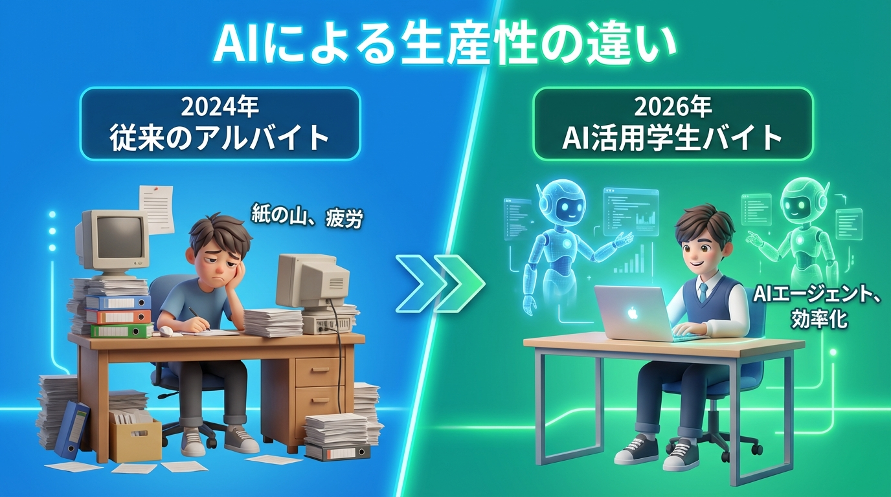
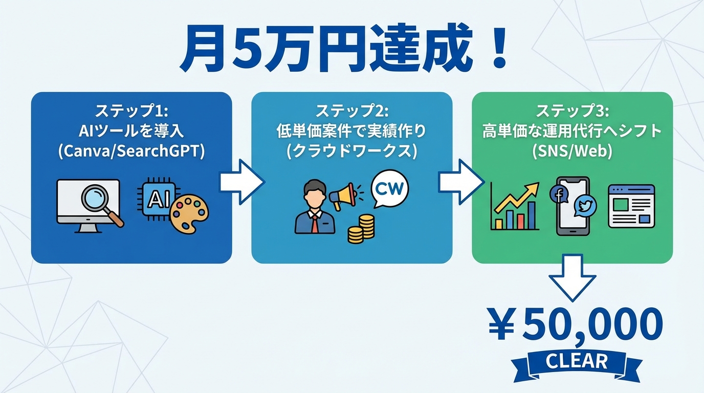
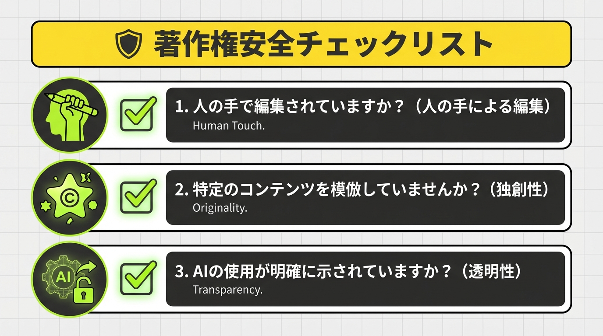

「今のバイト、時給が低くてしんどい…」「将来のためにAIを使いこなせるようになりたい」

そんな悩みを持つ大学生にとって、2026年は大きな転換点となりました。2年前までは「プロンプトを打つだけ」で稼げたAI副業も、今ではAIを「どう実務に落とし込むか」という設計力が問われる時代です。

マイナビの2026年卒調査（2025年6月発表）では、学生のAI利用率はすでに8割を超え、就活での活用も当たり前になりました。つまり、**「AIを使える」だけでは差別化にならない**のが今の現実です。

この記事では、2026年2月現在の最新トレンドと、文化庁の最新見解（2026年2月6日更新）を踏まえた、**「大学生が安全に、かつバイトより高効率で月5万円稼ぐための具体策」**を僕が徹底解説します。

---

## 1. 2026年、AI副業の「稼ぎ方」はどう変わったか？

2026年に入り、クラウドソーシングサイト（クラウドワークスやランサーズなど）での案件募集には明確な変化が起きています。

以前のような「AIで記事を量産する」だけの案件は単価が暴落し、現在は**「AIをディレクションして高品質な成果物を出す」**案件が主流です。

### 変化のポイント
- **時給単価の向上：** 単純作業はAIに置き換わりましたが、AIの出力をチェック・修正（人間による加筆）する工程に高い価値がついています。最新の時給相場は1,500円〜5,000円（ITreview 2026年1月データ）と、一般的なバイトを大きく上回ります。
- **企業のAI導入本格化：** BtoC企業の6割超がAI投資を拡大しており（Macbee Planet 2026年2月調べ）、特に「SNS運用」や「クリエイティブ作成」の外部委託が増えています。

---

## 2. 戦略1：AI×SNS運用代行（動画・画像生成の活用）

今、最も大学生が参入しやすく、かつ高単価を狙えるのが「ショート動画（TikTok/Reels/YouTubeショート）」の運用代行です。

### 2026年の最新手法
1.  **Sora 2やLumaによる動画生成：** 2025年後半から実用化が進んだ高精度動画AIを使い、実写のような背景動画を生成。
2.  **Canva Magic Studioでの編集：** AI機能をフル活用し、通常なら数時間かかる編集をわずか15分で完了させます。
3.  **独自性の担保：** 単なる生成ではなく、ターゲット層（Z世代など）のトレンドに合わせた「フック（冒頭の3秒）」を人間が設計します。

**狙える収入：** 1アカウント運用につき月額3万〜10万円。2〜3社掛け持つことで、大学生活と両立しながら月15万円以上稼ぐ学生も珍しくありません。

---

## 3. 戦略2：AIライティング・編集（「共感」と「一次情報」の付加）

AIライティングは「AIが書いた記事」をそのまま納品する時代から、**「AIが構成し、人間が魂を吹き込む」**時代へ進化しました。

### 月5万円稼ぐ具体的なステップ
- **ステップ1：** SearchGPTやPerplexityを使って、2026年の最新一次情報をリサーチする。
- **ステップ2：** AIに構成案を作らせ、本文の6〜7割を生成。
- **ステップ3：** 残りの3割に「自分の体験談」や「独自の視点」を加え、読者の共感を得る文章に調整する。

大手メディアや企業ブログでは、現在「AI生成＋人間による校閲・加筆」が必須条件となっており、このフローを完璧にこなせるワーカーの需要が急増しています。

---

## 4. 戦略3：AIツール導入・運用コンサル（地元の個人店向け）

実は今、最も穴場なのが「地方の個人店や中小企業」を対象にした、簡単なAIツール導入のお手伝いです。

### 大学生だからできる「お助け副業」
- **内容：** 「お店のメニュー紹介をAIで自動生成する」「予約対応のAIチャットボットを設置する」「Instagramの投稿をAIで自動化する」
- **営業先：** 普段通っているカフェや居酒屋、実家近くの商店など。
- **報酬形態：** 導入支援費（3万〜5万）＋月額保守費用（5千円〜1万）。

「AIって難しそう」と感じている大人世代にとって、AIを当たり前に使いこなす大学生は、それだけで「ITの専門家」として頼られる存在になれます。

---

## 5. 【超重要】2026年最新の著作権リスクと安全対策

副業で稼ぐ上で絶対に避けて通れないのが「著作権問題」です。文化庁が2026年2月6日に発表した最新の見解に基づき、以下の3点は必ず守ってください。

### 1. 「創作的寄与」を証明できるようにする
単に「画像生成して」と打つだけでは、その画像に著作権は認められません。プロンプトの修正履歴や、生成後にPhotoshop等で手動修正を加えたプロセスを記録しておくことで、自分の「著作物」として法的に保護されやすくなります。

### 2. 特定のクリエイターの模倣（過学習）を避ける
特定の絵師や作家のスタイルを意図的に模倣させる行為は、2026年のガイドラインでも「著作権侵害の可能性が高い」と明示されています。

### 3. AI生成物の明示（透明性義務）
欧州のAI Actの影響を受け、日本でも「AI生成物であることを明記する」ことがマナーから義務へと変わりつつあります。納品時には必ずAI使用の有無と範囲をクライアントに伝えましょう。

---

## まとめ：今日から始める「AI副業ロードマップ」

2026年のAI副業は、もはや「魔法の杖」ではありません。しかし、**「AIを最強の助手として使いこなす大学生」**になれば、間違いなくバイト代の数倍の価値を生み出せます。

1.  まずは**SearchGPTやCanvaの最新AI機能**を触ってみる。
2.  クラウドワークスで「AI活用可」の案件を1件（単価1,000円〜）受注してみる。
3.  慣れてきたら、SNS運用や記事編集で「自分にしかできない加筆」を加えて単価を上げる。

まずは月1万円。そこからステップアップして、4年生になる頃には「就活でAIディレクション実績を語れる」レベルを目指しましょう。

僕もこのブログを通して、常に最新のAI活用術を発信し続けます。一緒にアップデートしていきましょう！
