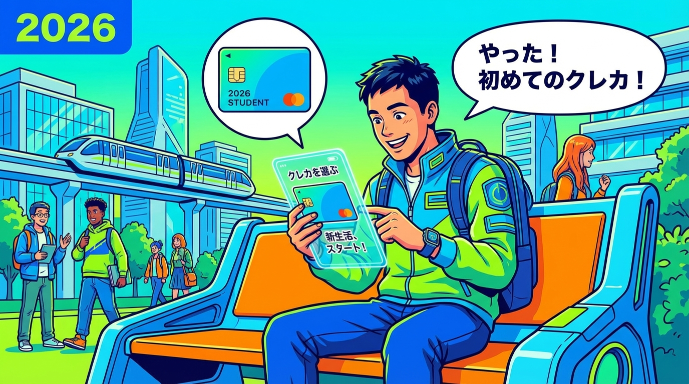
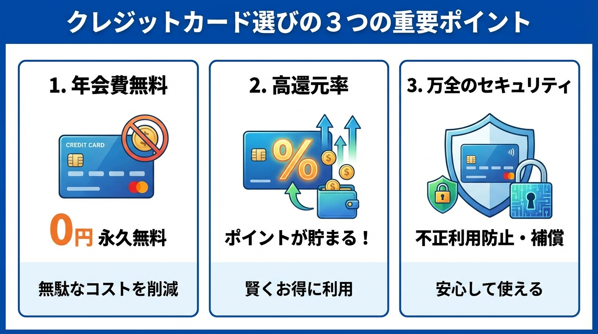
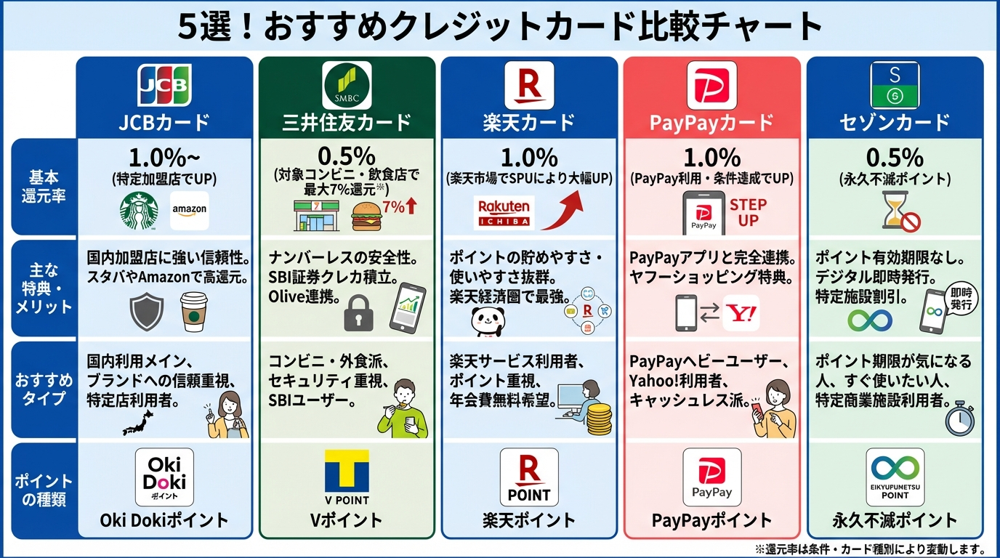
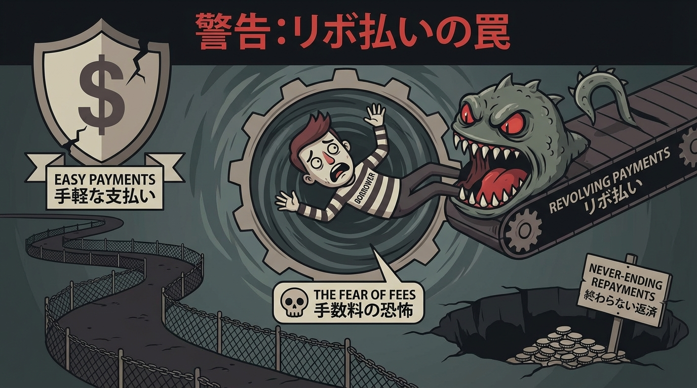

高校卒業、おめでとうございます！  
進学や就職、ひとり暮らしなど、新しい生活への期待で胸がいっぱいではないでしょうか？

そして、18歳を迎えて高校を卒業すると解禁される「大人の証」のひとつが**クレジットカード**です。  
ネットショッピングやサブスクの支払い、友達との旅行など、現金払いだけでは味わえない便利さが待っています。

でも、「種類が多すぎてどれがいいかわからない」「使いすぎて借金まみれになったらどうしよう」という不安もありますよね。

そこで今回は、**2026年最新のトレンド**を踏まえた、**18歳・高校卒業ですぐ作れるおすすめのクレジットカード**を厳選して紹介します。  
絶対に失敗しない選び方と、審査に一発で通るためのコツも解説するので、ぜひ最後まで読んでみてください。

## 1. 18歳・高校生がクレジットカードを作る前に知っておくべきこと

### いつから申し込める？高校生でも大丈夫？

結論から言うと、**多くのカード会社では「高校生」のうちは申し込みができません**。  
ただし、**高校卒業年の1月1日以降**であれば申し込み可能なカード（イオンカードなど）や、卒業式の翌日からOKとなるカードなど、会社によってルールが異なります。

一般的には、**高校を卒業した4月1日以降**、もしくは**卒業式を終えて進路が決まっている3月下旬**であれば、スムーズに作れるケースが多いです。

### 親の同意は必要？

2022年の民法改正により、成人年齢が18歳に引き下げられたため、**親権者の同意なし**でクレジットカードを作れるようになりました。  
ただし、初めての契約には不安がつきものです。トラブル防止のためにも、事前に家族へ相談しておくことをおすすめします。

### 2026年のトレンドは「ナンバーレス」＆「スマホ完結」

2026年現在、クレジットカードは**完全ナンバーレス**が主流です。

- 盗み見のリスクがない  
- アプリですぐ番号確認が可能  
- 最短10秒〜5分で発行され、カード到着前に利用可能  

初めての1枚こそ、セキュリティと利便性の両立が重要です。

## 2. 初めての1枚を選ぶ「失敗しない」3つの基準

### ① 年会費は「永年無料」

初めてのカードは**年会費永年無料**一択です。  
「初年度無料」「年1回利用で無料」などの条件付き無料は、初心者にはリスクがあります。

### ② よく行くお店で還元率が上がるか

- コンビニ・マクドナルド → **三井住友カード（NL）**
- Amazon・スタバ → **JCB CARD W**
- 楽天市場 → **楽天カード**

自分の生活圏に合うカードを選ぶことが最大の節約になります。

### ③ セキュリティ機能

- ナンバーレス
- 利用通知アプリ
- アプリからの利用制限機能  

この3点は必須です。

## 3. 【2026年最新】おすすめクレジットカード5選

### JCB CARD W
- 基本還元率：1.0%
- Amazon：2.0%
- スターバックス：最大約10.5%

### 三井住友カード（NL）
- 対象店舗で最大7%還元
- 完全ナンバーレス
- 学生向け特典あり

### 楽天カード
- 基本還元率：1.0%
- 楽天市場：3%以上

### PayPayカード
- PayPay残高と直結
- Yahoo!ショッピング最大5%

### セゾンカードデジタル
- 最短5分発行
- 完全ナンバーレス
- デザイン着せ替え可能

## 4. 審査に通るためのコツ

### 正確な情報入力
誤字脱字・虚偽申告はNGです。

### キャッシング枠は0円
審査通過率が大きく変わります。

### 同時申し込みはしない
まずは1枚だけに絞りましょう。

## 5. 【重要】リボ払いは絶対NG

リボ払いは年率15〜18%の高金利です。  
申し込み時に**自動リボ設定が入っていないか必ず確認**してください。

## まとめ

- Amazon・スタバ派 → **JCB CARD W**
- コンビニ派 → **三井住友カード（NL）**
- 楽天派 → **楽天カード**
- PayPay派 → **PayPayカード**
- 即日利用 → **セゾンカードデジタル**

最初の1枚を正しく選び、賢いキャッシュレス生活を始めましょう。