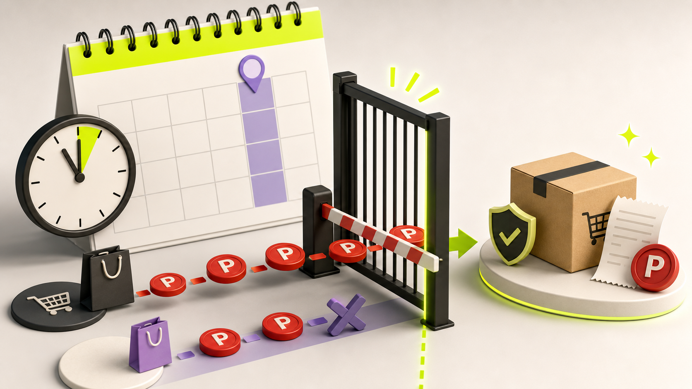

「いつものネット通販、dポイントマーケットを経由すればポイントが上乗せされる」——そんな定番ルートが、まもなく使えなくなります。

dポイントマーケットは、**2026年7月28日（火）正午をもってサービス終了**となります。

「終了前に買った商品のポイントはどうなる？」「毎日くじも終わる？」「これからは、どのポイントサイトを経由すればいいの？」と不安に感じている方も多いはずです。

でも、安心してください。**“ネット通販の前に1サイト経由する”という稼ぎ方そのものが終わるわけではありません。** 経由先を切り替えれば、これまで通りポイントの二重取り・三重取りを狙えます。

この記事では、dポイントマーケット終了の日程と注意点を整理したうえで、終了後に使いたい3つの代替ルートを分かりやすく解説します。

QUICK ANSWER

この記事の結論

<ul class="!mb-0 space-y-2 text-sm">
<li>dポイントマーケットは<strong>2026年7月28日（火）正午</strong>に終了</li>
<li>同日午前11時59分までに注文を完了し、各ショップの条件を満たせばポイント対象</li>
<li>終了後は「総合ポイントサイト」「楽天リーベイツ」「ショップ公式キャンペーン」を使い分ける</li>
<li>経由前に還元率と対象条件を確認し、購入完了まで同じブラウザを使う</li>
</ul>

## dポイントマーケットは2026年7月28日正午に終了

NTTドコモは、dポイントマーケットを**2026年7月28日（火）正午**に終了すると発表しています。

dポイントマーケットは、掲載ショップへ移動して買い物をすると、dポイントクラブの会員ランクに応じて最大1.5％のdポイントが貯まるサービスでした。約600サイト・1,800万点以上の商品を扱っていましたが、2024年10月の開始から約1年9カ月で終了することになります。

終了日時2026年7月28日（火）正午

注文期限同日午前11時59分まで

毎日くじサービスと同時に終了

終了後サイトへアクセス不可

公式発表は、[NTTドコモ「dポイントマーケット」のサービス提供を終了](https://www.docomo.ne.jp/info/news_release/2026/05/26_01.html)で確認できます。

### 終了前に買えば、dポイントは付与される？

公式発表によると、**7月28日午前11時59分までに各ショップで注文を完了**し、通常のポイント獲得条件を満たした買い物はポイント付与の対象です。

重要なのは、「dポイントマーケットのページを開いた時間」ではなく、**移動先ショップで注文を完了した時間**です。

終了当日はアクセス集中や決済エラーも考えられます。駆け込みで使う場合でも、できれば前日までに注文を済ませておくのが安全でしょう。

終了前に確認したい3項目

<ol class="space-y-2 text-sm mb-0">
<li><strong>1. 各ショップのポイント獲得条件</strong> クーポン利用、アプリ購入、予約後のキャンセルなどが対象外になる場合があります。</li>
<li><strong>2. 注文完了時刻</strong> 7月28日午前11時59分までに、ショップ側で注文を完了させます。</li>
<li><strong>3. 注文・経由の記録</strong> 念のため、経由画面や注文完了メールを保存しておきましょう。</li>
</ol>

## dポイントマーケット終了後に使いたい代替ルート3選

終了後は、すべての買い物を1つのサービスに任せるのではなく、**買うショップと欲しいポイントに合わせて経由先を選ぶ**のが正解です。

### 代替ルート1：モッピー・ハピタスなどの総合ポイントサイト

楽天市場、Yahoo!ショッピング、旅行予約、クレジットカード申込みなど、幅広い案件をまとめて探したいなら、総合ポイントサイトが第一候補です。

代表的なサービスには、モッピーやハピタスなどがあります。

MERIT

<ul class="text-sm space-y-2 mb-0">
<li>対応ショップやサービスが多い</li>
<li>現金・電子マネー・他社ポイントなど交換先が豊富</li>
<li>ショッピング以外の高額案件も探せる</li>
</ul>

CAUTION

<ul class="text-sm space-y-2 mb-0">
<li>同じショップでも還元率が変動する</li>
<li>交換先によって手数料や最低交換額が違う</li>
<li>アプリ経由やクーポン利用が対象外の場合がある</li>
</ul>

特定のポイントにこだわらず、最終的に現金やPayPayポイント、マイルなどへ交換したい人に向いています。

### 代替ルート2：楽天ポイント派なら楽天リーベイツ

Apple公式サイト、家電、ファッション、コスメ、旅行予約などの買い物で楽天ポイントを貯めたい場合は、楽天リーベイツが候補になります。

楽天リーベイツは楽天グループが運営するポイントバックサービスで、2026年3月には提携ストアが1,000店を突破しました。楽天市場そのものではなく、**提携する外部公式ストアへリーベイツを経由して買い物する**仕組みです。

楽天IDで利用でき、獲得した楽天ポイントは楽天ペイなどでも使えるため、楽天経済圏を利用している人には分かりやすい出口です。

詳しい仕組みは、[楽天PointClub「楽天リーベイツでポイントが貯まる」](https://point.rakuten.co.jp/get/shopping/rebates/)で確認できます。

### 代替ルート3：ショップ公式のキャンペーン・カード特典

ポイントサイトだけを見ていると、公式キャンペーンを見落とすことがあります。

たとえば、特定の決済方法、公式アプリ、会員ランク、キャンペーンへのエントリーによって、経由ポイントより大きな還元を受けられるケースがあります。

購入前には、次の順番で確認するのがおすすめです。

01

ショップ公式キャンペーン

エントリー、クーポン、会員限定還元を確認します。

02

ポイントサイトの還元率

複数サイトを比べ、獲得条件と対象外項目まで読みます。

03

支払い方法の還元

クレジットカードやQR決済の通常還元を重ねます。

## 代替サービスを選ぶときの比較ポイント

「結局、どこを使えば一番お得なの？」という答えは、買うショップと交換したいポイントによって変わります。

| 比較項目 | 総合ポイントサイト | 楽天リーベイツ | 公式キャンペーン |
| :--- | :--- | :--- | :--- |
| 向いている人 | 交換先を自由に選びたい | 楽天ポイントを貯めたい | 特定ショップをよく使う |
| 主な強み | 案件数と交換先 | 楽天IDで分かりやすい | 還元率が高い場合がある |
| 注意点 | 条件・交換手数料 | 対象外ストアがある | 開催期間が短い |
| 確認頻度 | 買い物のたび | 買い物のたび | キャンペーンごと |

POINT HACK

還元率だけで即決しないこと。

「税・送料を除いた金額だけが対象」「アプリから購入すると対象外」「クーポン利用分は対象外」など、条件によって実際の獲得ポイントは変わります。最終的な受取額と、ポイントの使いやすさまで含めて選びましょう。

## 経由ポイントを取りこぼさないための注意点

代替サービスを使い始めても、経由方法を間違えるとポイントが付かないことがあります。

### 購入前にCookieと広告ブロックを確認する

ポイントサイトは、Cookieなどを利用して「どのサイトからショップへ移動したか」を判定します。広告ブロック機能、トラッキング防止、複数ブラウザの行き来によって記録されない場合があります。

### 経由後は商品を入れ直す

先にショップで商品をカートへ入れ、その後ポイントサイトを経由すると対象外になることがあります。確実性を上げるなら、ポイントサイトから移動したあとに商品を選び直しましょう。

### 還元率と条件の画面を保存する

還元率は変動します。高額な買い物では、利用日、還元率、対象条件、注文番号が分かる画面を保存しておくと、問い合わせが必要になったときに役立ちます。

## まとめ：終了後は「1サイト固定」から「買い物ごとの使い分け」へ

dポイントマーケットは2026年7月28日正午で終了しますが、ネット通販の経由ポイ活が終わるわけではありません。

SUMMARY

<ul class="mt-6 mb-0 space-y-3">
<li><strong>dポイントマーケットは7月28日正午に終了。</strong></li>
<li><strong>午前11時59分までに注文を完了し、獲得条件を満たせばポイント対象。</strong></li>
<li><strong>終了後は総合ポイントサイト、楽天リーベイツ、公式キャンペーンを使い分ける。</strong></li>
<li><strong>還元率だけでなく、対象条件と交換先まで確認する。</strong></li>
</ul>

これからのポイ活は、「いつも同じ入口を使う」よりも、**買う前に30秒だけ比較する人が強い時代**です。

dポイントマーケット終了をきっかけに、自分がよく使うショップと、使いやすいポイントの出口を一度整理してみてください。経由先が変わっても、お得を取りにいく習慣はそのまま続けられます。
