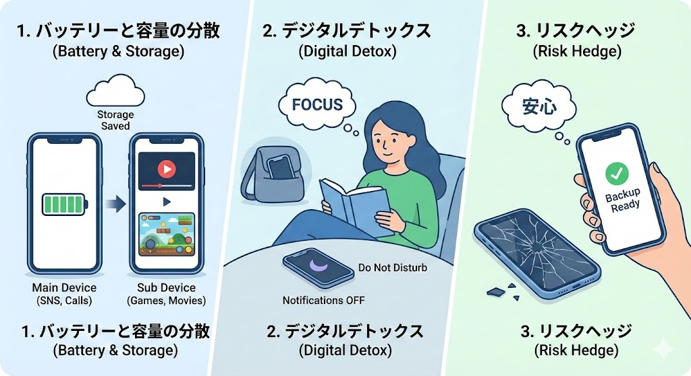
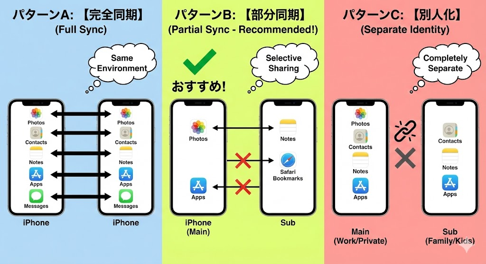
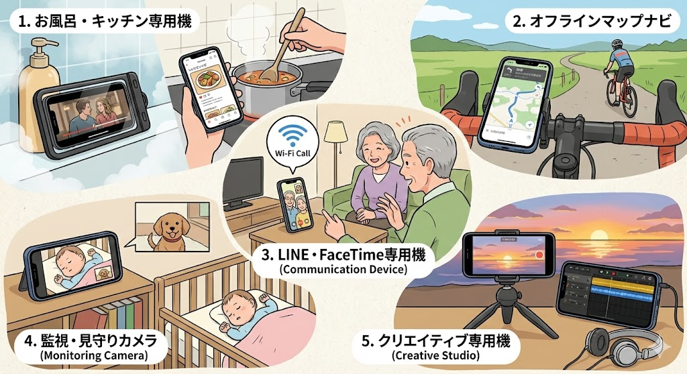

機種変更をした後、手元に残った古いiPhone。「下取りに出すには画面が割れているし、売っても二束三文だし…」と、引き出しの奥に眠らせていませんか？

正直に言います。**それ、ものすごくもったいないです！**

実は、SIMカードが入っていない「契約切れのiPhone」こそ、最強のサブ機になり得るポテンシャルを秘めています。月額料金0円で、生活の質（QOL）を爆上げするツールに変わるのです。

「でも、Wi-Fiがないと使えないんでしょ？」
「2台あるとデータが混ざって面倒くさそう…」

そんな疑問を持つあなたのために、長年iPhone2台持ちスタイルを実践している僕が、**SIMなし運用のメリットから、多くの人がつまずく「データ同期」の設定**まで、余すことなく解説します。

この記事を読み終わる頃には、あなたの古いiPhoneは「ただの不用品」から「手放せない相棒」に変わっているはずです。

## iPhone2台持ちは「SIMなし」でこそ輝く

まず結論から言うと、**サブ機にSIM契約は不要**です。もちろん、格安SIMを契約して電話番号を2つ持つという選択肢もありますが、多くの人にとってそれはオーバースペック。

家の中ではWi-Fi、外ではメイン機のテザリング（インターネット共有）。これだけで99%の機能は使えます。

### なぜわざわざ2台持つのか？決定的な3つのメリット

僕がなぜ、重たい思いをしてまで（最近のiPhoneは重いですよね…）2台持ちを推奨するのか。それには明確な理由があります。

#### 1. メイン機のバッテリーとストレージを守れる
これが最大のメリットです。SNS、動画視聴、ゲーム、ナビ。これらを全て1台でこなすと、最新のiPhoneでも夕方にはバッテリーが瀕死になります。
「動画とゲームはサブ機にお任せ」と役割分担するだけで、メイン機の充電持ちは劇的に改善します。さらに、写真や動画データをサブ機に逃がせば、メイン機のストレージ不足も解消できます。

#### 2. 「スマホ依存」からの脱却（デジタルデトックス）
「勉強中や仕事中、ついついSNSを見てしまう…」
そんな経験はありませんか？
2台持ちなら、物理的に用途を分けることができます。
* **メイン機：** 電話、LINE、仕事の連絡（通知ON）
* **サブ機：** YouTube、Netflix、ゲーム、SNS（通知OFF）

仕事中はサブ機をカバンの中にしまっておく。これだけで、驚くほど集中力が上がります。「物理的に分ける」効果は絶大です。

#### 3. リスクヘッジ（予備機としての安心感）
メイン機をトイレに落とした、紛失した、あるいは突然故障した。
そんな時、手元に「もう一台のiPhone」がある安心感は計り知れません。SIMカードを差し替えるだけで、とりあえずの連絡手段は確保できます。「保険」として持っておくだけでも価値があります。

## SIMなしiPhone（Wi-Fi運用）で「できること」リスト

「SIMがないと電話できないじゃん」と思われがちですが、今の時代、電話回線を使う機会はどれくらいあるでしょうか？
SIMなしのiPhoneでも、Wi-Fi環境さえあればこれだけのことができます。

* **LINE通話・Skype・Zoom:** 通話もビデオ会議も問題なし。
* **Webブラウジング・SNS:** Twitter（X）、Instagram、TikTokなど全て閲覧・投稿可能。
* **動画・音楽ストリーミング:** YouTube、Prime Video、Apple Music、Spotifyなど。
* **カーナビ:** Googleマップなどの地図アプリ（※後述するオフラインマップを活用すればWi-Fiなしでも可）。
* **おサイフケータイ（Apple Pay）:** 実は、SuicaやiDなどは通信圏外でも決済可能です（チャージには通信が必要）。

つまり、**「電話番号を使った音声通話」と「Wi-Fiがない場所での単独通信」以外は、普段のiPhoneと全く同じ**なのです。

## 一番の悩みどころ。「データ同期」はする？しない？

2台持ちを始める際、もっとも質問が多いのがこれです。
**「Apple IDは同じにするべき？ 写真や連絡先は同期しちゃうの？」**

ここ設定を間違えると、「メイン機に届いた通知がサブ機でも鳴り響いてうるさい」「見られたくない写真が家族用のサブ機に同期されてしまった」という事故が起きます。

筆者が推奨する運用パターンは以下の3つです。あなたの用途に合わせて選んでください。

### パターンA：【完全同期】（自分一人でフル活用する人向け）
メイン機とサブ機を**「全く同じ状態」**にする設定です。
* **Apple ID:** 同じIDを使用
* **iCloud設定:** 全てオン

**メリット：**
どの端末を手に取っても、同じメモが見られ、同じ写真があり、同じアプリが使えます。「リビングにはサブ機、寝室にはメイン機」といったように、場所によって使い分ける場合にシームレスです。

**デメリット：**
ストレージ（容量）を圧迫します。また、着信や通知が2台同時に来るため、設定で通知を間引く必要があります。

### パターンB：【部分同期】（一番おすすめ！）
Apple IDは同じにしつつ、**必要なデータだけを共有**する設定です。
* **Apple ID:** 同じIDを使用
* **iCloud設定:** 「写真」オフ、「メモ」オン、「Safari」オンなど、個別に設定。

**メリット：**
「写真は同期したくないけど、パスワードやメモは共有したい」という、いいとこ取りができます。サブ機を「容量の少ない古いiPhone」にする場合、写真同期をオフにするのは必須テクニックです。

**デメリット：**
設定画面で一つ一つオン・オフを選ぶ手間があります。

### パターンC：【別人化】（家族・子供に使わせる場合）
* **Apple ID:** 別のIDを作成（またはファミリー共有）

**メリット：**
データが完全に分離されます。古いiPhoneを「子供のYouTube専用機」や「お店のBGM用」にする場合はこれ一択です。プライバシーも完全に守られます。

---

## 【実践編】SIMなしiPhoneの具体的な活用アイデア5選

ここからは、実際に僕がやっている、あるいは友人に勧めて好評だった活用法を紹介します。

### 1. 「お風呂・キッチン・寝室」専用機
水没や油汚れのリスクがある場所、それが水回りです。
高価な最新のiPhone 15などを風呂場に持ち込むのは勇気がいりますが、画面が割れたiPhone 8ならどうでしょう？
ジップロックや防水ケースに入れて、お風呂で映画鑑賞。キッチンでクックパッドを表示しっぱなしにする。寝室で寝落ちするまでKindleを読む。
メイン機を大切に使うために、**「汚れ役」をサブ機に任せる**のです。

### 2. オフラインマップで「0円カーナビ・サイコン」
Googleマップには「オフラインマップ」という機能があります。自宅のWi-Fiで地図データをダウンロードしておけば、**外で電波がなくてもナビとして機能します**（iPhoneにはGPSが内蔵されているため、SIMなしでも位置情報は取得できます）。
バイクや自転車のハンドルに固定して、ナビやサイクルコンピュータとして使うのもアリです。振動でカメラが壊れるリスクがありますが、サブ機なら許容範囲でしょう。

### 3. 固定電話代わりの「LINE・FaceTime専用機」
実家の両親や、まだスマホを持っていない子供に、Wi-Fiに繋いだ古いiPhoneを渡しておきます。
LINEやFaceTimeのアプリを入れておけば、**通話料無料のホットライン**の完成です。
「家の電話」を解約して、このスタイルにする家庭も増えています。

### 4. 監視カメラ・見守りモニター
「Alfred Camera」などのアプリを使えば、古いiPhoneが**高機能な監視カメラ**に変身します。
Wi-Fiに繋いで部屋の隅に置いておけば、外出先からペットの様子を見たり、赤ちゃんのベビーモニターとして使ったりできます。動体検知機能がついているアプリも多く、防犯カメラとしても優秀です。

### 5. クリエイティブ専用機（撮影・音楽制作）
通知が来ない環境は、創作活動に最適です。
GarageBandでの作曲、iMovieでの動画編集、あるいはタイムラプス動画の長回し撮影。
メイン機で電話を待ち受けながら、サブ機で何時間もタイムラプスを撮影する。こんな使い方ができるのも2台持ちならではです。

## セットアップの注意点：これをやっておこう

最後に、快適な2台持ちライフを始めるためのセットアップ手順を解説します。

### ①初期化（リセット）
前のデータが残っているとストレージを圧迫しますし、動作も重くなります。
「設定」→「一般」→「転送またはiPhoneをリセット」から、一度工場出荷状態に戻し、新しいiPhoneとして設定することをおすすめします（バックアップからの復元は、必要なデータのみに留めましょう）。

### ②「iMessage」と「FaceTime」の設定確認
ここが重要です。SIMなしのiPhoneでも、Wi-Fi環境下なら電話番号宛のSMS（iMessage）や着信を受け取れてしまうことがあります。
これが便利な場合もありますが、**「2台同時に着信音が鳴ってパニック」**になる原因第一位です。

不要であれば、サブ機の設定で
* 「設定」→「メッセージ」→「iMessage」をオフ
* 「設定」→「FaceTime」をオフ
にしておきましょう。

### ③不要なアプリの削除と通知オフ
サブ機に入れるアプリは厳選しましょう。バッテリーを持たせるためにも、使わないアプリは徹底的に削除。
また、メイン機と同じアプリを入れる場合でも、サブ機側の**「通知」は全てオフ**にすることを強くおすすめします。静寂こそがサブ機の価値です。

---

## まとめ：余ったiPhoneは「宝の山」

iPhoneは、数年前のモデルであっても、その処理能力は非常に高いです。単なる「電話機」としてではなく、「高性能な小型コンピュータ」として見直せば、使い道は無限にあります。

* **バッテリーや容量を気にせず使い倒せる**
* **用途を分けてデジタルデトックスができる**
* **万が一の時のバックアップになる**

これらが**「追加コスト0円」**で手に入るのです。
引き出しの中で眠っているそのiPhone、まずは充電ケーブルに繋いで、第2の人生（iPhone生？）を歩ませてみてはいかがでしょうか？
きっと、あなたの生活を少しだけ便利で、豊かなものにしてくれるはずです。
