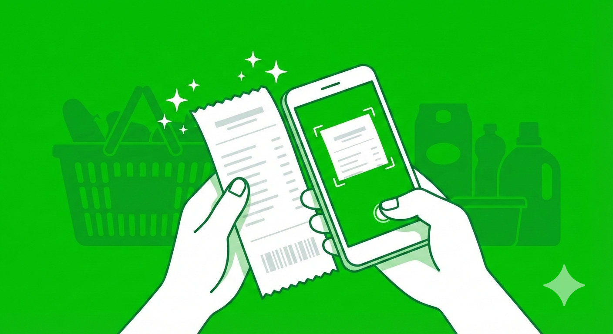
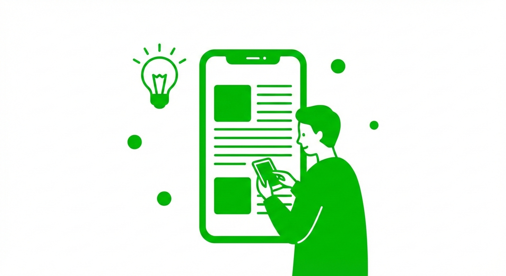

「LINEスタンプや着せ替えが欲しいけど、わざわざ課金するのはちょっと…」
「LINE Payがなくなってから、LINEポイントが全然貯まらなくなった」

そんな悩みを抱えていませんか？

2025年4月にLINE Payの国内サービスが終了して以降、「日々の買い物で自動的にポイントが貯まる」という王道ルートは消滅しました。その結果、多くの人が「もうLINEポイントは貯められない」と諦めてしまっています。

しかし、実は**2026年現在、LINEポイントの貯め方は「決済」から「行動」へと完全にシフト**しており、知っている人だけがスキマ時間を使って毎月大量のポイントを稼ぎ出しているのです。

この記事では、筆者が徹底的にリサーチし、実際に実践している**「LINEポイントを無料で爆稼ぎする5つの裏技」**を大公開します。

すべて公式のサービスを使った安全な方法でありながら、コツさえ掴めば好きなスタンプや着せ替えが毎月無料で買い放題になるレベルで貯まります。ぜひ今日から試してみてください。

## LINE Pay終了後の2026年、ポイント事情はどう変わった？

具体的な裏技を紹介する前に、2026年現在のLINEポイントを取り巻く状況を少しだけ解説します。

以前は「LINE Payで支払えば数％還元」という受動的なポイ活が主流でした。しかし現在、LINE公式が注力しているのは、**ユーザーが自発的にLINEのサービスに触れる「行動・タスク型」の還元**です。

歩く、遊ぶ、読む、スキャンする。
こうした日常のちょっとしたアクションに対して、LINEは予算を投じてポイントを配布しています。つまり、「どこにポイントが落ちているか」という**情報戦**になっているのです。

それでは、今のLINE環境に最適化された、最も効率の良い裏技5選を見ていきましょう。

## LINEポイントを無料で爆稼ぎする裏技級の5つの方法

ここからは、スマホ1台あれば今すぐ完全無料で始められる5つの裏技を解説します。どれも単体で強力ですが、組み合わせることで圧倒的なスピードでポイントが貯まります。

### 裏技1：歩くだけでザクザク！「LINE WALK（ラインウォーク）」のフル活用

2026年現在、最も手軽でチリツモ効果が高いのが、歩数計機能の「LINE WALK」です。通勤・通学や買い物など、毎日の移動がそのままポイントに直結します。

**【稼ぎ方の手順と裏技】**
LINE WALKでは、目標歩数を達成するごとに「ゼリー（コインの元）」を獲得できます。このゼリーを回収する際、**必ず「短い動画広告を見て獲得」を選択してください。**

通常タップの数倍のコインが獲得できるため、効率がまったく違います。貯まったコインは「300,000コイン＝3,000ポイント」などのレートで直接LINEポイントに交換可能です。

さらに裏技として、週末に開催されることの多い「歩数ブーストキャンペーン」を見逃さないようにしましょう。この日は歩数上限が引き上げられたり、獲得コインが倍増したりするため、休日のお出かけがそのままスタンプ代に変わります。

### 裏技2：スキマ時間はこれ一択！「LINEポイゲ（ゲーム）」で遊びながら稼ぐ

LINE Pay終了後の目玉コンテンツとして公式が猛プッシュしているのが「LINEポイゲ」です。パズルゲームなどを遊びながら、ミッションをクリアすることでポイントがもらえます。

**【稼ぎ方の手順と裏技】**
「マージジェリー」などの対象ゲームをプレイし、1日のデイリーミッションをこなすのが基本です。しかし、真の裏技はゲーム内にある**「ポイガチャ」**にあります。

特定のミッションクリアや広告視聴で回せるこのガチャは、ハズレなしでLINEポイントが当たります。テレビを見ている時間や、電車に乗っている時間の「手が空いている数分間」をすべてポイゲに充てるだけで、1週間で50〜100ポイント（クリエイターズスタンプ1個分）は余裕で射程圏内に入ります。

「遊ぶだけで稼げる」という、まさに現代の錬金術です。

### 裏技3：捨てる前にスキャン！「LINEレシート」で日々の買い物をポイント化

コンビニやスーパーでもらったレシート、そのまま捨てていませんか？それは非常にもったいないです。「LINEレシート」機能を使えば、そのゴミがポイントに変わります。

**【稼ぎ方の手順と裏技】**
LINEのウォレットタブなどから「LINEレシート」を開き、買い物のレシートをカメラで撮影してアップロードするだけです。1枚につき数ポイントが還元されます。

ここでの裏技は**「対象商品ボーナス」を狙い撃ちすること**です。
日用品や飲料など、指定されたメーカーのキャンペーン対象商品を買ったレシートを登録すると、通常の読み取りポイントとは別に「+50ポイント」などの特大ボーナスが一気に付与されます。

普段の買い物リストと、LINEレシートのキャンペーンページを照らし合わせる癖をつけるだけで、ポイントの貯まる速度が劇的に跳ね上がります。

### 裏技4：チリツモ最強！「LINEポイントクラブ」の動画視聴＆タップ

もっとも労力がかからず、誰もが確実にポイントを拾えるのが「LINEポイントクラブ」内のミッションです。

**【稼ぎ方の手順と裏技】**
LINEアプリの「ウォレット」タブからポイントクラブにアクセスすると、「記事を読むだけ」「公式アカウントを友だち追加するだけ」「動画を見るだけ」といったミッションがズラリと並んでいます。

裏技というより「最強のルーティン」ですが、**毎朝起きた直後の3分間をこれに充ててください。**
とくに「動画を見てポイントゲット」は毎日更新されることが多く、タップして放置しておくだけで確実に2〜5ポイントが手に入ります。月に換算すればこれだけで100ポイント前後になり、着せ替え購入の大きな足しになります。

追加した公式アカウントは、ポイント付与が確認できた後、通知オフにするかブロック・削除すれば、LINEの画面が散らかる心配もありません。

### 裏技5：情報収集でお小遣い稼ぎ！「LINE Monary（モナリー）」で記事を読んで貯める

お金や節約に関するお役立ちコンテンツを配信している「LINE Monary」も、2026年現在見逃せないポイント源です。

**【稼ぎ方の手順と裏技】**
LINE Monary内で配信される特定の記事を最後までスクロールして読むだけで、ポイントがもらえるキャンペーンが頻繁に実施されています。

ここでの裏技は、**月末・月初に集中する「読了キャンペーン」のタイミングを逃さないこと**です。
「期間中に5記事読めば〇〇ポイント山分け」といった大盤振る舞いなイベントが定期的に開催されます。お金に関する正しい知識（節約術やNISAの最新動向など）を身につけながら、ついでにLINEポイントも稼げるため、一石二鳥の自己投資と言えます。

## 貯めたポイントでスタンプ・着せ替えを無料で手に入れる手順

上記5つの方法を1ヶ月も継続すれば、数百ポイントは優に貯まっているはずです。
貯まったポイントは、以下の手順でスタンプや着せ替えと交換しましょう。

1. LINEアプリの「ホーム」タブから「スタンプ」または「着せ替え」ショップを開く
2. 欲しいアイテムを選び「購入する」をタップ
3. 決済画面で「LINEポイントを使用」にチェックを入れる
4. 全額ポイントで支払いを完了する

※注意点として、スタンプショップ内の通貨「LINEコイン」を購入する必要はありません。決済画面で直接「LINEポイント」を選択することで、1ポイント＝1コイン（※実際の変換レートは公式の最新情報を確認してください）として充当できます。

## 注意点とアカウント凍結を防ぐためのルール

最後に、ポイ活を安全に続けるための重要な注意点をお伝えします。

裏技といっても、不正ツールを使ったり、規約違反をしたりするのは絶対にNGです。
例えば、LINE WALKでスマホを自動で振る機械（振り子）を使ったり、LINEレシートで他人のレシートを拾ってスキャンしたりする行為は、**アカウント停止（凍結）の対象**になります。

LINEのアカウントが凍結されると、今まで貯めたポイントはもちろん、友だちリストやこれまでのトーク履歴もすべて消滅してしまいます。
今回紹介したのは、あくまで「公式が用意した仕組みを最大限に効率よく使う方法」です。必ず正攻法でコツコツと積み上げてください。

## まとめ：2026年は「スキマ時間の行動」が最強の裏技になる

いかがでしたでしょうか。
LINE Payという巨大なポイント源がなくなった2026年ですが、LINEが提供する様々なサービスをフル活用すれば、まだまだ余裕でスタンプや着せ替えを無料で楽しむことができます。

**【おさらい：5つの裏技】**
1. **LINE WALK**：移動をコインに変え、広告視聴でブーストする
2. **LINEポイゲ**：スキマ時間にゲームを遊び「ポイガチャ」を回す
3. **LINEレシート**：捨てる前にスキャンし、対象商品ボーナスを狙う
4. **LINEポイントクラブ**：毎朝のタップと動画視聴をルーティン化する
5. **LINE Monary**：月末・月初の読了キャンペーンで一気に稼ぐ

最初は1日10ポイント程度かもしれませんが、1ヶ月、3ヶ月と続けることで「気づいたら着せ替えが3つ買えるくらい貯まっていた！」という状態になります。

まずは今日、通勤中やベッドの中での5分間を使って、どれか1つから始めてみてくださいね！
