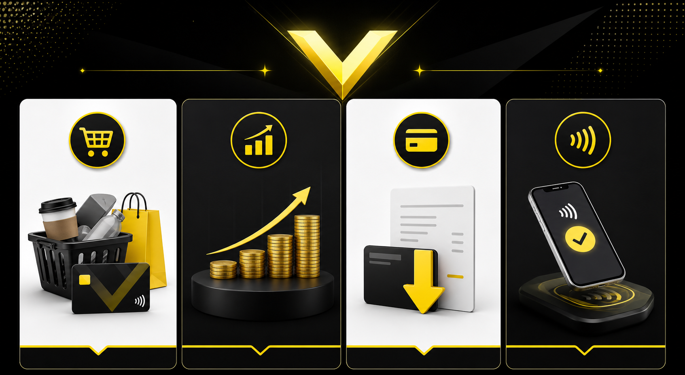

「Vポイントって、結局どこで使うのがいちばん損しないの？」

三井住友カードの還元やVポイントアプリでポイントが貯まりやすくなった一方で、**使い道を間違えると“1ポイントの価値”を活かし切れません。**

なんとなく景品交換に流したり、期限や使い勝手を考えずに消化したりすると、せっかく貯めたVポイントの破壊力が一気に落ちます。

逆に言えば、**出口さえ間違えなければ、Vポイントはかなり強い部類のポイント**です。日常の支払いに回してもいいし、投資に回してもいい。2026年は特に、使い道の優先順位を決めておく価値があります。

この記事では、**2026年7月8日時点でおすすめできるVポイントの使い道**を、分かりやすくランキング形式で整理します。

QUICK ANSWER

先に結論だけ知りたい人へ

<ul class="!mb-0 space-y-2 text-sm">
<li>すぐ使いたいなら<strong>PayPayポイント交換</strong>が最有力</li>
<li>増やす前提なら<strong>SBI証券で投資に回す</strong>のが強い</li>
<li>シンプルさ重視なら<strong>カード支払い充当</strong>が失敗しにくい</li>
<li>街で1円単位で使いたいなら<strong>VポイントPay</strong>も便利</li>
</ul>

## いまVポイントの使い道を真面目に考えるべき理由

Vポイントは、昔の「とりあえず貯まるけど出口が弱いポイント」ではありません。

三井住友カードの還元、Vポイントアプリの機能、そして他サービスとの連携が進んだことで、**“使う・投資する・決済に回す”の3方向がかなり整ってきました。**

ただし、選び方を間違えると次のようなズレが起きます。

すぐ使いたい人投資に回すと現金感がなくて続かない

増やしたい人単純消費だけだと伸びしろがない

管理が面倒な人交換ルートが複雑だと結局放置しがち

つまり大事なのは、**「どれが一番得か」よりも「自分の使い方に一番ハマる出口はどれか」**です。

## Vポイントの使い道おすすめランキング4選

### 1位：PayPayポイントに交換して日常の支払いに回す

いちばんおすすめしやすいのは、やはり**PayPayポイントとして使うルート**です。

理由は単純で、**使える場所が多く、1ポイントの使い勝手がとにかく高い**からです。

コンビニ、ドラッグストア、飲食店、ネット決済まで、PayPayは日常の消費にかなり深く入り込んでいます。Vポイントをそのまま“生活費の軽減”に変えやすいのが最大の強みです。

MERIT

<ul class="text-sm space-y-2 mb-0">
<li>日常で使いやすく、消化に困りにくい</li>
<li>「ポイントを使わず放置する」事故が起きにくい</li>
<li>初心者でも価値を実感しやすい</li>
</ul>

向いている人

<ul class="text-sm space-y-2 mb-0">
<li>毎月の出費を少しでも軽くしたい人</li>
<li>投資より先に節約効果を感じたい人</li>
<li>ポイント管理を複雑にしたくない人</li>
</ul>

とくに、Vポイントを貯めるルートまで含めて考えるなら、[レシタメ記事](../articles_html/ReceiTame.html) とセットで相性がいいです。**稼ぐ入口と使う出口が一本につながる**ので、かなり分かりやすい流れになります。

### 2位：SBI証券で投資に回す

「すぐ使う」より「将来に回したい」という人には、**SBI証券での活用**がかなり強いです。

Vポイントの良さは、少額からでも“消費”ではなく“資産側”へ動かせること。現金を追加で出さなくても、普段の買い物で貯めたポイントを投資のタネにできます。

とくに、

- 新NISAを始めたばかりの人
- 毎月の積立を少しでも軽くしたい人
- 「ポイントは使うより増やしたい」と考える人

このあたりには刺さりやすいです。

もちろん、投資なので短期で必ず増えるわけではありません。でも、**なんとなく消費して終わるより、長期目線では期待値が高い使い方**になりやすいのが魅力です。

POINT HACK

Vポイントを“使わずに終わる人”ほど、投資ルートを検討する価値があります。

数百ポイントでも投資に回しておけば、「消えた」感覚ではなく「積み上がった」感覚に変わります。ポイ活を一段上に持っていきたい人向けです。

### 3位：カード支払い金額に充当する

派手さはないですが、**実用性だけで見るとかなり優秀**なのが支払い充当です。

「交換とか設定とか、もう面倒くさい」
「でも損はしたくない」

そんな人にはこの使い方が合っています。

貯まったVポイントをカード請求の軽減に回せるなら、感覚としてはかなり現金に近いです。とくに毎月コンスタントにカードを使う人なら、**使い道に悩む時間ごと消してくれる**のがこのルートの良さです。

向いているのはこんな人です。

- ポイント管理に時間をかけたくない
- 交換ミスやルート変更を追いかけたくない
- 家計の固定費感覚で淡々と得したい

爆発力ではPayPayや投資に少し譲りますが、**“失敗しない出口”としてはかなり上位**です。

### 4位：VポイントPayで街の支払いに使う

「Vポイントをそのまま街で使いたい」という人には、**VポイントPay** も候補です。

Visa系の使い方に乗せやすいのが特徴で、**1ポイント1円感覚で消化しやすい**のが魅力です。

特に、三井住友カード系の流れでVポイントを貯めている人には自然につながりやすいルートです。[三井住友カード活用記事](../articles_html/Mitsui.html) でも触れている通り、**「Vポイントをどう使うか」で迷ったときの実用品ルート**としてかなり優秀です。

ただし、初心者の分かりやすさではPayPayに一歩譲るので、今回は4位にしています。

## 結局どれを選べばいい？タイプ別のおすすめ

ここまで読んでも迷う人向けに、かなり雑に言い切ります。

| あなたのタイプ | いちばん向いている使い道 |
| :--- | :--- |
| とにかく生活費を減らしたい | PayPayポイント交換 |
| 長期で増やしたい | SBI証券で投資 |
| 面倒なことが嫌い | 支払い充当 |
| 街で細かく使いたい | VポイントPay |

迷ったら、まずは**PayPay** か **支払い充当** のどちらかでOKです。

この2つは「難しすぎて続かない」が起きにくいので、Vポイント初心者でも失敗しにくいです。

## やりがちな失敗3つ

Vポイントは優秀ですが、使い方で損しやすいポイントもあります。

### 1. 交換先だけ見て、実際に使う場面を考えていない

理論上お得でも、自分が使わない場所でしか活きないなら意味がありません。

たとえば投資に回しても、値動きが気になってストレスになる人には向いていません。逆に、PayPayへ回しても結局あまり使わない人なら宝の持ち腐れです。

### 2. 少額ポイントをずっと寝かせる

100ポイント、200ポイントくらいだと「また今度でいいや」となりがちですが、これが一番もったいないです。

少額でも、

- 支払いに回す
- 投資に回す
- 日常決済に回す

のどれかに動かした方が、**放置より100倍マシ**です。

### 3. 古いルート情報をそのまま信じる

ポイ活の世界は、交換先や条件が変わるのが本当に早いです。

去年は最適だったルートが、今年は普通に微妙になっていることもあります。だからこそ、**“昔見たおすすめ”ではなく、今の自分に合う出口を選ぶ**のが大事です。

## まとめ：迷ったら「PayPay」か「投資」で考えれば大きく外さない

Vポイントは、2026年時点でもかなり使い勝手のいいポイントです。

SUMMARY

<ul class="mt-6 mb-0 space-y-3">
<li><strong>すぐ使うならPayPayポイント交換が最有力。</strong></li>
<li><strong>増やしたいならSBI証券で投資に回すのが強い。</strong></li>
<li><strong>シンプルさ重視なら支払い充当が安定。</strong></li>
<li><strong>街で細かく使いたいならVポイントPayも有力。</strong></li>
</ul>

僕のおすすめは、かなりシンプルです。

**迷ったら「すぐ使うならPayPay」「育てるならSBI証券」**。まずはこの二択で考えれば、大きく外しません。

Vポイントは、貯め方だけでなく**出口まで設計して初めて強いポイント**です。

「なんとなく貯める」から一歩進んで、あなたの生活にいちばん合う使い道を決めてみてください。そこで初めて、Vポイントが“ただのポイント”から“使える資産”に変わります。
